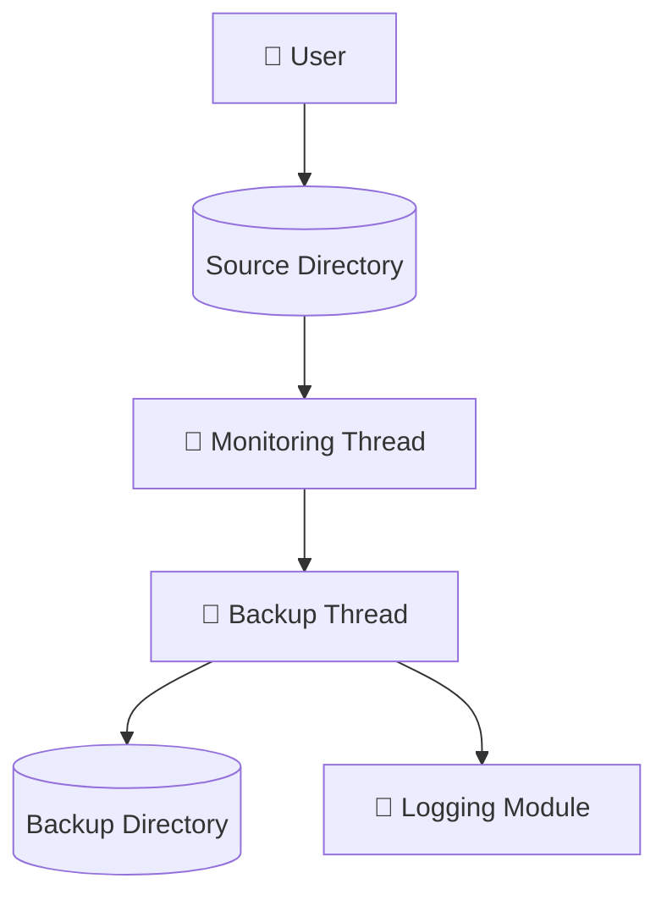

<div align="center">

# ⚙️ Real-Time Automatic Backup Daemon

### Linux-Based File Monitoring & Backup System

A multi-threaded Linux daemon that automatically monitors directories and performs real-time file backups using filesystem events.


</div>

---

## 📖 Overview

This project implements a Linux daemon that continuously monitors files and directories for changes and automatically creates backups in real time.

The system uses Linux filesystem notifications (`inotify`), POSIX threads, signal handling, and recursive directory traversal to provide efficient and reliable backup management.

---

## 🚀 Technologies Used

- C Programming
- Linux System Programming
- POSIX Threads (pthreads)
- Inotify API
- Signal Handling
- File System Operations
- Daemon Processes

---

## 🏗️ System Architecture



---

## ✨ Features

- Real-time file monitoring
- Automatic backup creation
- Recursive directory scanning
- Multi-threaded implementation
- Linux daemon execution
- Event-driven architecture using inotify
- Logging and status tracking
- Signal-based process control

---

## 🔍 Monitored Events

The daemon tracks:

- File creation
- File modification
- File deletion
- File movement / renaming
- Directory creation

using Linux's **inotify** subsystem.

---

## ⚙️ Key Components

| Component | Purpose |
|------------|------------|
| Monitor Thread | Watches filesystem events |
| Backup Thread | Performs backup operations |
| Inotify Watchers | Detect directory/file changes |
| Signal Handler | Graceful daemon termination |
| Logger | Records backup activities |

---

## 📂 Project Structure

```text
├── src/
│   ├── daemon.c
│   ├── monitor.c
│   ├── backup.c
│   ├── logger.c
│   └── utils.c
│
├── include/
├── logs/
├── backups/
└── README.md
```

---

## 🔄 Workflow

1. Daemon starts in background.
2. Inotify watchers are attached to target directories.
3. Monitor thread waits for filesystem events.
4. Events are forwarded to backup thread.
5. Backup thread synchronizes modified files.
6. Activity is recorded in log files.

---

## 🎯 Learning Outcomes

- Linux daemon development
- Multithreading with POSIX threads
- Event-driven programming
- File system monitoring
- Signal handling
- Concurrent system design

---

## 👥 Team Members

- Rahi Narodia
- Om Patel
- Ramit Shershiya
- Shyam Ramani
- Shlok Thakkar
